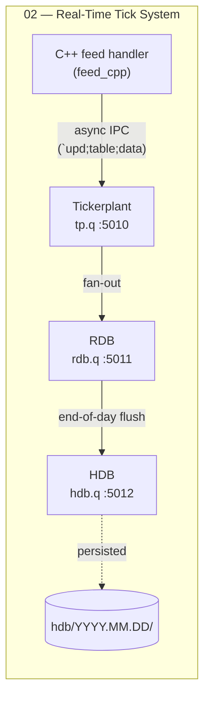

# kdb+ / q Portfolio

A growing body of work on **kdb+/q** and **low-latency market-data engineering** — built
while moving into a kdb+/q developer role. Each project is self-contained, documented, and
tested, and mirrors a piece of a real investment-bank data stack.

> **Goal:** demonstrate production-shaped kdb+ skills — tick architecture, IPC, partitioned
> storage, C++ feed handlers, testing and benchmarking — not toy snippets.

## Projects

| # | Project | Focus | Languages | Highlights |
|---|---------|-------|-----------|------------|
| 01 | [q Data Explorer](projects/01_q-data-explorer/) | q fundamentals · qSQL · CSV/HDB | q | guided walkthrough, annotated from scratch |
| 02 | [Real-Time Tick System](projects/02_real-time-tick/) | tick architecture · IPC · C++ | q, C++ | **C++ feed handler speaking raw kdb+ IPC**, RDB/HDB, tests, benchmarks |
| 03 | [Java HDB Service](projects/03_java-hdb-service/) | Spring Boot · kdb+ IPC · REST | Java, q | REST API over the HDB via the KX Java client; pooling, tests |
| 04+ | _planned_ | C# subscriber to the tickerplant | C# | enterprise-language track |

## Architecture at a glance



See [`docs/architecture.md`](docs/architecture.md) for the full picture and
[project 02's architecture](projects/02_real-time-tick/docs/architecture.md) for sequence
diagrams. Architecture decisions are recorded as
[ADRs](projects/02_real-time-tick/docs/adr/).

## Skills demonstrated

| Area | Where |
|---|---|
| q language, qSQL, table ops | 01, 02, 03 |
| Tick architecture (tickerplant / RDB / HDB) | 02 |
| IPC: `hopen`, sync/async, `.z.pg`/`.z.ps`, subscriber catch-up | 02 |
| Partitioned + splayed HDB, `.Q.en`, sym enumeration | 01, 02 |
| **C++**: raw sockets, custom binary serialization, feed handler | 02 |
| **Java**: Spring Boot, REST, connection pooling, kdb+ IPC client | 03 |
| Software engineering: DRY, KISS/YAGNI, single responsibility | 02, 03 |
| Testing: byte-exact unit tests, end-to-end integration, web tests | 02, 03 |
| Benchmarking: throughput + latency measurement | 02 |

## Repository layout

```
kdb-portfolio/
  README.md                 <- you are here
  LICENSE
  docs/architecture.md      <- portfolio-level architecture
  projects/
    01_q-data-explorer/     <- q fundamentals (guided)
    02_real-time-tick/      <- flagship: tick system + C++ feed
      docs/architecture.md
      docs/adr/             <- Architecture Decision Records
    03_java-hdb-service/    <- Spring Boot REST service over the HDB
      docs/architecture.md
      docs/adr/
```

## Running a project

Each project has its own README. For the flagship:

```bash
cd projects/02_real-time-tick
sudo apt-get install -y g++ make   # one-time, for the C++ feed
bash build.sh && bash start.sh
q verify.q
bash tests/run_tests.sh
bash bench/bench.sh
```

## License

MIT — see [LICENSE](LICENSE).
