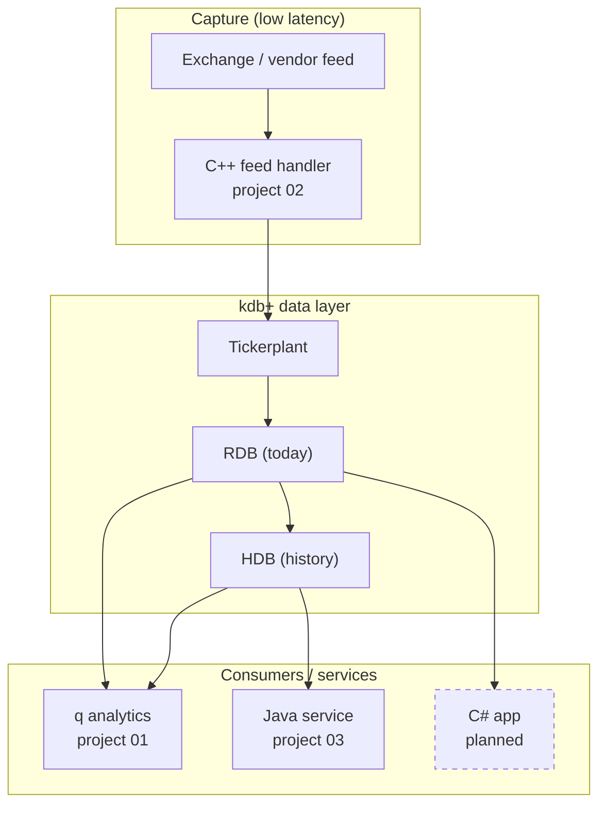
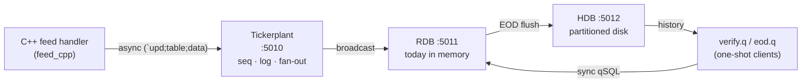

# Architecture

A high-level view of the portfolio and how the projects fit together. Detailed diagrams
for the flagship live in
[project 02's architecture](../projects/02_real-time-tick/docs/architecture.md).

## Context

The projects replicate pieces of an investment bank's market-data / quant platform. The
long-term goal is an end-to-end slice: data capture (C++) → q tick store → analytics →
enterprise services (Java/C#).

Dashed nodes are planned. Everything else is implemented in this repository.

## Project 02 — real-time tick system

The canonical kdb+ architecture: one ingestion point, sequenced and logged, fanned out to
live and historical stores.

## Project 01 — q data explorer

A guided, from-scratch walkthrough of q fundamentals: generating data, CSV round-trips,
column profiling, qSQL aggregation, and saving a splayed HDB. It is the on-ramp; project 02
is the destination.

## Design principles across projects

| Principle | How it shows up |
|---|---|
| Separation of concerns | one process per responsibility; services decoupled via IPC |
| DRY | single shared `config.q`; pure helpers in `lib.q` |
| KISS / YAGNI | one uniform message shape; no speculative abstraction |
| Testability | pure functions + byte-exact and end-to-end tests |
| Measurability | benchmarks for throughput and latency |
| Documentation | READMEs, narrative walkthroughs, Mermaid diagrams, ADRs |
