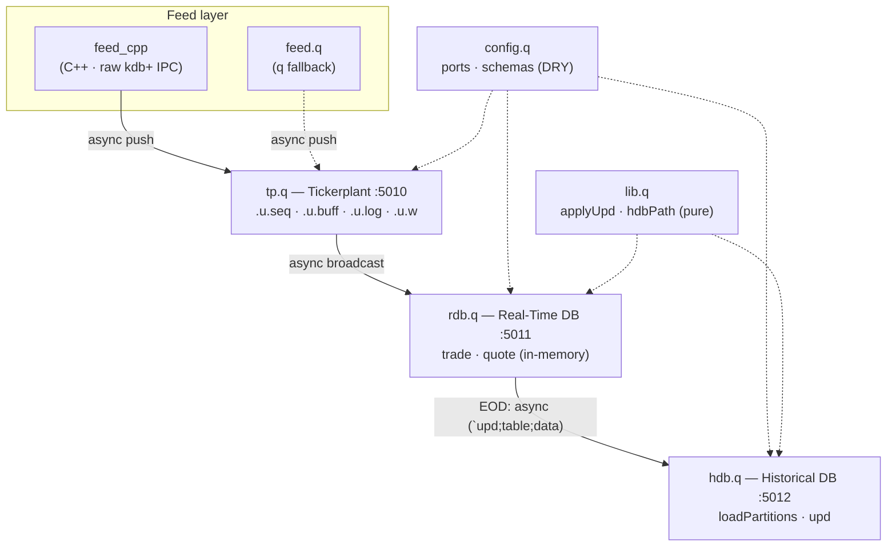
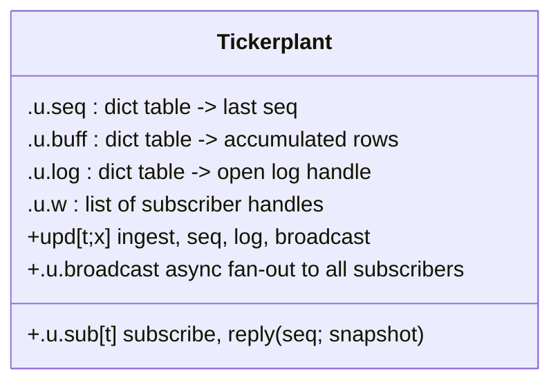

# Architecture — Real-Time Tick System

Detailed diagrams for project 02. See [`../README.md`](../README.md) for setup and
[`02_codeAlongThrough.md`](../02_codeAlongThrough.md) for the narrative walkthrough.

## Components



## Live update flow (feed → tp → rdb)

```mermaid
sequenceDiagram
    autonumber
    participant F as feed_cpp (C++)
    participant T as Tickerplant
    participant R as RDB

    Note over R,T: at startup
    R->>T: sync (`u.sub; `trade) — subscribe
    T-->>R: (current seq; full snapshot)
    R->>R: .u.lastSeq[trade]=snapshot seq

    loop every 100ms
        F->>T: async (`upd; `trade; table)
        T->>T: .u.seq[trade]++
        T->>T: append to disk log (recovery)
        T->>T: append to .u.buff (catch-up)
        T--)R: broadcast (`upd; `trade; seq; table)
        R->>R: if seq > .u.lastSeq[trade]: apply (de-dup)
    end
```

## End-of-day flow (rdb → hdb)

```mermaid
sequenceDiagram
    autonumber
    participant Z as eod.q / .z.ts timer
    participant R as RDB
    participant H as HDB

    Z->>R: .eod[]
    R->>H: async (`upd; `trade; trade)
    R->>H: async (`upd; `quote; quote)
    R->>R: trade::0#trade; quote::0#quote
    H->>H: .Q.en(CFG.hdbDir) — enumerate syms
    H->>H: splay → hdb/YYYY.MM.DD/trade/
    Note over H: on restart, loadPartitions()<br/>reloads history and resolves syms
```

## Tickerplant state



## On-disk HDB layout

```
hdb/
  sym                       symbol enumeration (written by .Q.en)
  2026.10.05/
    trade/                  splayed columns
      .d  time  sym  price  size
    quote/
      .d  time  sym  bid  ask  bsize  asize
  2026.10.06/
    ...
```

Each date is a partition directory; each table is a splayed (column-per-file) directory.
This is the standard kdb+ layout and scales to billions of rows.

## Ports

| Process | Port | Role |
|---|---|---|
| tickerplant | 5010 | ingest, sequence, log, fan-out |
| rdb | 5011 | today's data, live queries |
| hdb | 5012 | partitioned history |
| feed (q fallback) | 5013 | simulated feed |
