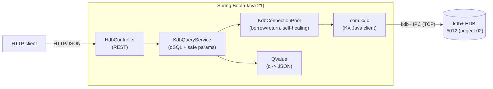

# hdb-service — REST over a kdb+ HDB

A **Spring Boot** service that exposes a kdb+ **historical database (HDB)** over HTTP.
It connects to kdb+ with the official KX Java client over the native **kdb+ IPC protocol**,
runs **qSQL** queries, and returns JSON.

This is the **enterprise-language track** of the portfolio: project 02 produces the HDB with
C++/q; this project consumes it from Java — exactly how a bank's Java/Spring services read
from the kdb+ data layer.

## Architecture



See [`docs/architecture.md`](docs/architecture.md) for sequence diagrams, and
[`docs/adr/`](docs/adr/) for the key decisions.

## API

| Method & path | Description |
|---|---|
| `GET /api/health` | liveness + kdb+ reachability (200 UP / 503 DOWN) |
| `GET /api/symbols` | distinct symbols in the HDB |
| `GET /api/stats` | per-symbol aggregates (count, avg/min/max price, total size) |
| `GET /api/stats/{symbol}` | aggregates for one symbol |
| `GET /api/trades/{symbol}?limit=N` | recent trades for a symbol (N clamped to 1000) |
| `GET /api/daily` | daily trade count and average price |

Example:

```bash
curl localhost:8080/api/stats
# [{"sym":"AAPL","cnt":184,"avgPx":124.49,"minPx":101.03,"maxPx":149.73,"totSize":96694}, ...]

curl "localhost:8080/api/trades/MSFT?limit=2"
# [{"time":"2026-10-05T12:34:35.782086760Z","price":102.53,"size":574}, ...]
```

## Run

Prerequisite: a kdb+ HDB listening on `:5012` (start project 02's HDB — see its README).
The service connects lazily, so it starts even if the HDB is down (health reports DOWN).

```bash
# configure the kdb+ endpoint in src/main/resources/application.yml if not localhost:5012
mvn spring-boot:run
# or
mvn -DskipTests package && java -jar target/hdb-service-0.0.1-SNAPSHOT.jar
```

## Build & test

```bash
mvn test          # unit tests: q->JSON conversion + web layer (11 tests)
mvn -DskipTests package
```

## Design notes

- **Connection pool.** kdb+ connections are stateful and not thread-safe, so the service
  never shares one across requests. `KdbConnectionPool` borrows/returns connections,
  validates them (self-healing) and creates new ones on demand.
- **Conversion.** `QValue` maps q values (tables/`Flip`, vectors, dicts, atoms, temporal
  types) to Jackson-serializable Java types. q timestamps render as ISO-8601 strings.
- **Input safety.** Symbols are interpolated into qSQL (q has no bind variables), so they
  are validated against `^[A-Za-z0-9._-]{1,32}$`; row limits are clamped.
- **Config.** All connection settings live under `kdb.*` in `application.yml`.

## KDB-X note

KDB-X 5.0 does not accept the `date$` cast (e.g. `date$time`); use `"d"$time` instead.
The `/api/daily` query reflects this.
