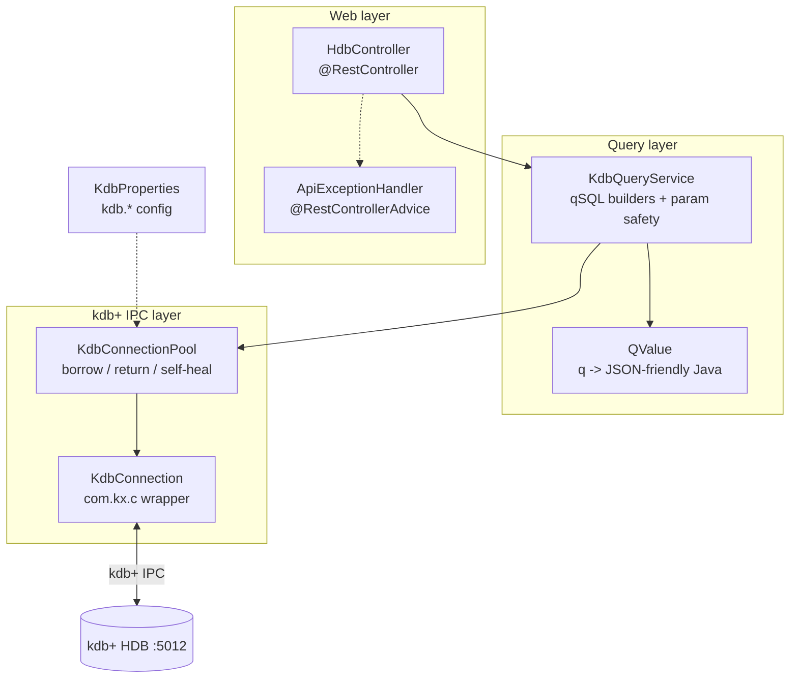
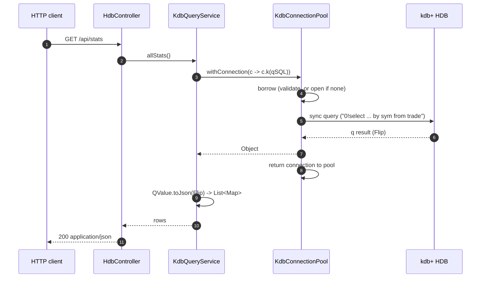
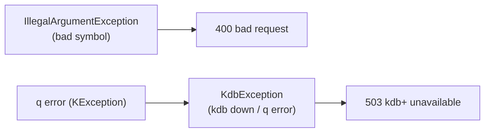

# Architecture — hdb-service

Detailed diagrams for project 03. See [`../README.md`](../README.md) and
[`adr/`](adr/) for the decisions.

## Components

## Request flow

## Error mapping

## Dependencies

- `spring-boot-starter-web` — embedded Tomcat, REST, Jackson
- `spring-boot-starter-validation`
- `com.kx:javakdb:2.2` — the official KX Java client for kdb+ IPC (Apache-2.0)
- `spring-boot-starter-test` — JUnit 5, MockMvc, Mockito, AssertJ
