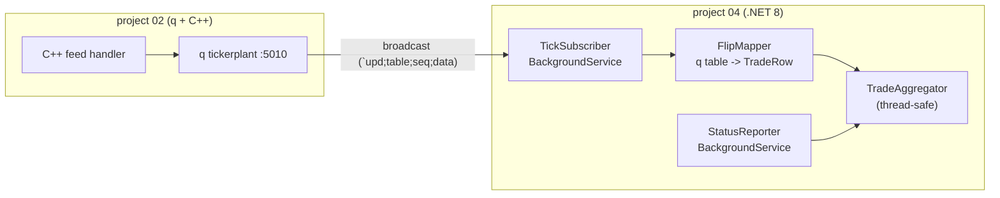

# tick-subscriber — C# subscriber to the kdb+ tickerplant

A **.NET 8** console service that subscribes to the kdb+ **tickerplant** over IPC, receives
live updates as they are broadcast, and maintains a rolling per-symbol aggregate
(count, last price, VWAP, total size). It uses the **official KX C# client** (`CSharpKDB`).

This completes the **enterprise-language track**: project 02 publishes with C++, project 03
serves history over Java/REST, and project 04 consumes the live stream from C# — the three
languages a bank's trading technology stack is actually built from.

## Architecture



See [`docs/architecture.md`](docs/architecture.md) and [`docs/adr/`](docs/adr/).

## What it does

1. Connects to the tickerplant (`kdb:host`/`kdb:port`, default `localhost:5010`).
2. Subscribes with `ks(".u.sub", "trade")`.
3. Reads every pushed message with `kAsync()` and maps `trade` tables to rows.
4. Folds each row into `TradeAggregator` and prints a status snapshot every 2s.
5. Reconnects automatically if the connection drops.

Example output:

```
total rows received: 770
  AAPL  count=138    last=  142.22 vwap=  124.85 size=69535
  AMZN  count=150    last=  122.28 vwap=  126.43 size=77952
  ...
```

## Run

Prerequisite: a kdb+ **tickerplant** listening on `:5010` (start project 02; the tickerplant
is `tp.q`). The subscriber starts even if the tickerplant is down and retries.

```bash
cd projects/04_csharp-subscriber
dotnet run --project src/Subscriber
```

Configure via `src/Subscriber/appsettings.json`:

```json
{ "Kdb": { "Host": "localhost", "Port": 5010, "Tables": [ "trade" ], "ReportIntervalMs": 2000 } }
```

## Build & test

```bash
dotnet build
dotnet test          # 6 unit tests: aggregator + q-table mapping
```

## Design notes

- **Generic host.** Standard .NET hosting: DI, config, logging, graceful shutdown. The
  subscriber is a `BackgroundService`; the reporter is a second one.
- **Pure, tested core.** `TradeAggregator` holds no kdb+ types and is unit tested;
  `FlipMapper` isolates the `c.Flip` -> `TradeRow` conversion.
- **Schema tolerant.** An update whose table doesn't match the trade schema is ignored, not
  fatal — the mini tickerplant broadcasts every table to every subscriber.
- **C# strings are q symbols.** In CSharpKDB a .NET `string` serializes as a q symbol, so
  `ks(".u.sub", "trade")` sends `` (`.u.sub; `trade) `` — exactly what the tp expects.
- **Reconnect.** On any IPC failure the service logs, waits, and re-subscribes.
