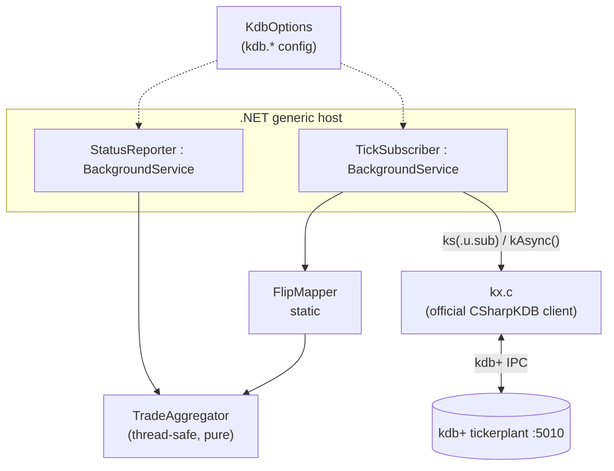
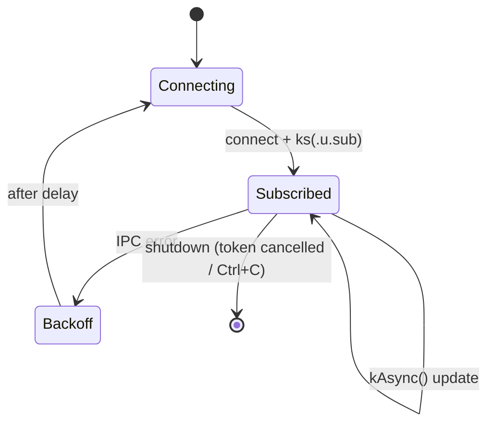

# Architecture — tick-subscriber

Detailed diagrams for project 04. See [`../README.md`](../README.md) and [`adr/`](adr/).

## Components



## Subscription flow

```mermaid
sequenceDiagram
    autonumber
    participant S as TickSubscriber
    participant C as kx.c client
    participant T as kdb+ tickerplant
    participant A as TradeAggregator

    S->>C: new c(host, 5010)
    C->>T: IPC handshake
    S->>C: ks(".u.sub", "trade")
    C->>T: async (`.u.sub; `trade)
    T->>T: register handle in .u.w
    loop every 100ms (feed pushes)
        T--)C: (`upd; `trade; seq; table)
        C-->>S: kAsync() -> object[]
        S->>S: FlipMapper.TryToTrades(...)
        S->>A: Apply(TradeRow)
    end
    loop every 2s
        S-->>S: StatusReporter prints aggregator.Snapshot()
    end
```

## Lifecycle & resilience



## Dependencies

- `CSharpKDB` 1.7.0 — official KX C# client for kdb+ IPC
- `Microsoft.Extensions.Hosting` 8.x — generic host (DI, config, logging, lifetime)
- `xunit` — unit tests
